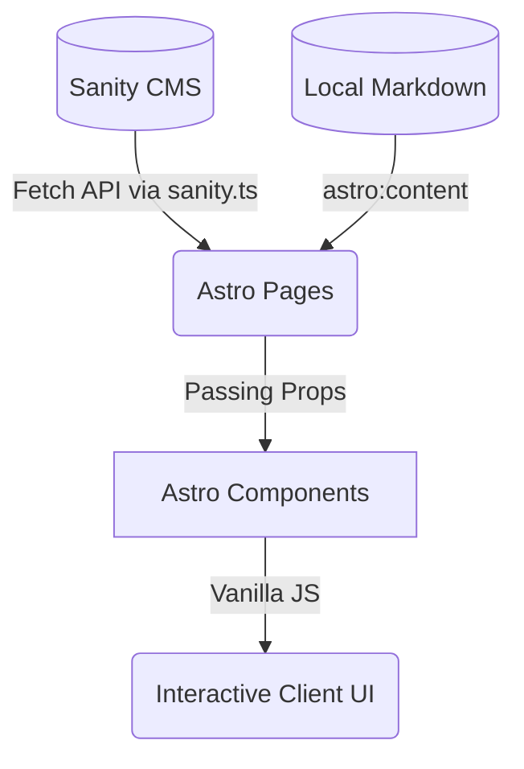

# Yokai Web Architecture

## Overview
Proyek ini dibangun menggunakan **Astro**, sebuah *web framework* yang berfokus pada kecepatan dan optimalisasi pengiriman konten (content-driven). Arsitektur utamanya menganut pola **SSG (Static Site Generation)** atau berpotensi **SSR (Server-Side Rendering)** yang dipadukan dengan konsep **Islands Architecture** khas Astro, di mana mayoritas halaman di-render sebagai HTML statis (tanpa JavaScript di sisi klien) dan hanya komponen interaktif tertentu (seperti Modal atau Carousel) yang akan memuat JavaScript.

Sumber data situs (CMS) utamanya menggunakan **Sanity** (Headless CMS), namun memiliki mekanisme cadangan (fallback) ke **Local Markdown** (`src/content`) untuk memastikan aplikasi tetap berjalan ketika API Sanity tidak tersedia atau untuk konten-konten statis.

## Struktur Direktori
Pemisahan folder di dalam `src/` didesain secara modular berbasis domain (fitur) untuk memudahkan skalabilitas.

- `src/assets/`: Menyimpan file statis (gambar, video placeholder) yang akan diproses oleh Astro build step.
- `src/components/`: Berisi kumpulan komponen antarmuka yang dapat digunakan ulang (reusable UI). Dipecah lagi menjadi subfolder spesifik per fitur:
  - `/about`: Komponen khusus halaman About Us (Hero, Our Story, Track Record).
  - `/blog`: Komponen untuk artikel, waza, dan pembaruan (PostCard, RelatedPosts).
  - `/common`: Komponen utilitas lintas fitur (Breadcrumbs).
  - `/landing`: Komponen untuk halaman depan (HeroLanding, Projects, Schedule).
  - `/members`: Komponen untuk daftar anggota (AccordionStrip, CreditsPanel).
  - `/shop`: Komponen e-commerce sederhana dan etalase merchandise.
- `src/content/`: Berisi koleksi konten lokal (Markdown) yang dikelola oleh Astro Content Collections API. Bertindak sebagai *fallback* data.
- `src/layouts/`: Kerangka dasar halaman HTML (`BaseLayout.astro`) tempat `<head>`, global metadata, Navbar, dan Footer berada.
- `src/lib/`: Fungsi utilitas *shared logic*:
  - `sanity.ts`: Konfigurasi Sanity client, query builder, dan definisi tipe data ketat (TypeScript Interfaces).
  - `markdown.ts`: Fungsi parser untuk merender Markdown lokal.
- `src/pages/`: Bertindak sebagai **Router** aplikasi. Setiap file `.astro` di folder ini akan otomatis menjadi rute URL (misal `about.astro` menjadi `/about`).
- `src/sanity/schemas/`: Definisi skema data untuk Sanity Studio (backend data structure).
- `src/styles/`: Global CSS styling. Menggunakan Vanilla CSS dan Tailwind directives.

## Alur Data (Data Flow)

Data mengalir secara satu arah (unidirectional) dari sumber ke antarmuka pengguna:

1. **Pengambilan Data (Fetch Phase)**: Di dalam Astro page (contoh: `src/pages/index.astro`), fungsi asinkron (await) akan memanggil data. Logika saat ini memprioritaskan pengambilan dari **Sanity** menggunakan GROQ queries.
2. **Fallback**: Jika Sanity gagal mengembalikan data (karena tidak ada koneksi, atau dokumen kosong), kode akan mengambil data dari file Markdown lokal atau *hardcoded fallback object* sebagai cadangan.
3. **Prop Drilling (Render Phase)**: Data yang telah dibersihkan dan diproyeksikan bentuknya akan dilempar ke komponen Astro (dalam `src/components/`) melalui `Astro.props`.
4. **Client-Side Interactivity**: Komponen Astro merender HTML penuh di sisi server. Interaktivitas sisi klien (seperti animasi *Anime.js*, transisi tab, atau modal) ditangani dengan blok `<script>` yang disematkan langsung di dalam komponen Astro. State tidak dikelola menggunakan framework berat seperti React, melainkan state lokal DOM melalui Vanilla JS (`document.getElementById`, `addEventListener`).

## Dependency Lintas Fitur
- **`src/lib/sanity.ts`**: Merupakan **Single Point of Truth** untuk seluruh struktur data eksternal. Hampir semua halaman di `src/pages/` bergantung padanya untuk tipe data (TypeScript Interfaces) dan inisialisasi Client.
- **`Layout.astro` & `BaseLayout.astro`**: Semua halaman wajib membungkus kontennya di dalam layout ini agar gaya global (`global.css`) dan komponen navigasi utama dirender.
- Komponen `PostCard` (`src/components/blog/`) tidak hanya digunakan di halaman *Blog/Library*, tetapi juga direplikasi penggunaannya di *Updates* (`src/pages/updates/`). Ini mengharuskan perubahan pada PostCard sangat diperhatikan agar tidak memecah layout di tempat lain.
